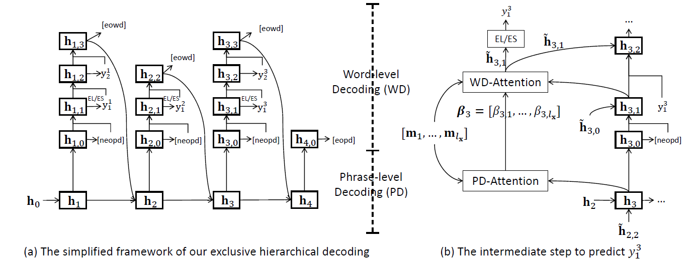

# ExHiRD-DKG
The source code for the ACL 2020 paper [Exclusive Hierarchical Decoding for Deep Keyphrase Generation](https://arxiv.org/pdf/2004.08511.pdf)

<p align="center"></p>

# Table of contents
   * [Citation](#citation)
   * [Dependencies](#dependencies)
   * [Get the processed train/val/test datasets](#get-the-processed-train/val/test-datasets)
   * [Process training and validation data to ONMT style](#process-training-and-validation-data-to-onmt-style)
   * [Training](#training)
   * [Testing](#testing)
   * [Evaluate the predictions](#evaluate-the-predictions)
   * [Download our final predictions](#download-our-final-predictions)

# Citation
You can cite our paper by:
```
@article{DBLP:journals/corr/abs-2004-08511,
  author    = {Wang Chen and
               Hou Pong Chan and
               Piji Li and
               Irwin King},
  title     = {Exclusive Hierarchical Decoding for Deep Keyphrase Generation},
  journal   = {CoRR},
  volume    = {abs/2004.08511},
  year      = {2020},
  url       = {https://arxiv.org/abs/2004.08511},
  archivePrefix = {arXiv},
  eprint    = {2004.08511},
  timestamp = {Wed, 22 Apr 2020 12:57:53 +0200},
  biburl    = {https://dblp.org/rec/journals/corr/abs-2004-08511.bib},
  bibsource = {dblp computer science bibliography, https://dblp.org}
}
```

# Dependencies
- python 3.6.8
- pytorch 1.0 (CUDA9.0)
- torchtext 0.4.0

The full dependencies are listed in `Requirements.txt`.

# Get the processed train/val/test datasets
Download the [processed testing datasets](https://www.dropbox.com/s/tavebz23va1hvrd/ExHiRD_test_datasets.zip?dl=1).
Download the [processed train_valid_dataset](https://www.dropbox.com/s/5sbwt2k66nly1ib/ExHiRD_train_valid_dataset.zip?dl=1).

The words in the file name have the following meanings:
  - `PbfA_ordered`: the present keyphrases are put in front of the absent keyphrases. The present keyphrases are sorted by their positions of the first appearance.
  - `addBiStokens`: One start token is added to each present keyphrase and The other start token is added to each absent keyphrase.
  - `addSemicolon`: For each keyphrase, we add `;` as the ending token.
  - `RmStemDups`: The duplicated keyphrases (after stemming) is removed.
  - `RmKeysAllUnk`: After building the vocabulary, we remove the absent keyphrases in which every token is in neither the vocabulary nor the source input. 

# Process training and validation data to ONMT style
Create a new folder `data` under the home folder (i.e., ExHiRD-DKG), download the [processed train_valid_dataset](https://www.dropbox.com/s/5sbwt2k66nly1ib/ExHiRD_train_valid_dataset.zip?dl=1) into `data`, unzip the `.zip` file.
Run the following command lines to process the data into ONMT style:
```
cd sh/preprocess/
sh preprocess_kp20k_seqE_HRD_PbfA_ordered_addBiSTokens_addSemicolon_RmStemDups_RmKeysAllUnk.sh
```
Next, download the [vocabulary](https://www.dropbox.com/s/a7ivosx29cnpson/full_processed_kp20k.vocab.pt?dl=0) file into the onmt-processed data folder: `data/train_valid_dataset/onmt_processed_data/with_copy_seqE_HRD_PbfA_ordered_addBiSTokens_addSemicolon_RmStemDups_RmKeysAllUnk`. Then, the processing is finished. 

**Note:** To run all bash files smoothly, you may need to specify the correct `home_dir` (i.e., the absolute path to ExHiRD-DKG) and replace the python path to yours.

# Training
Train an ExHiRD-h model:
```
cd sh/ExHiRD/
sh ExHiRD_h_seed3435_PbfA_ordered_addBiSTokens_addSemicolon_RmStemDups_RmKeysAllUnk_train.sh
```
Train an ExHiRD-s model:
```
cd sh/ExHiRD/
sh ExHiRD_s_seed3435_PbfA_ordered_addBiSTokens_addSemicolon_RmStemDups_RmKeysAllUnk_train.sh
```
You may need to set `CUDA_VISIBLE_DEVICES` in these bash files to run them smoothly.

# Testing
Test a trained ExHiRD-h model:
```
cd sh/ExHiRD/
sh ExHiRD_h_seed3435_history1_4_PbfA_ordered_addBiSTokens_addSemicolon_RmStemDups_RmKeysAllUnk_translate.sh
```
Test a trained ExHiRD-s model:
```
cd sh/ExHiRD/
sh ExHiRD_s_seed3435_PbfA_ordered_addBiSTokens_addSemicolon_RmStemDups_RmKeysAllUnk_translate.sh
```
You may need to set `CUDA_VISIBLE_DEVICES` in these bash files to run them smoothly. The evaluation of the predictions is also integrated in this step and the evaluation results are stored in the corresponding log files.


# Evaluate the predictions
After specifying the corret path of the predictions and testing datasets in the `sh/evaluation/evaluate_ExHiRD_h.sh` and `sh/evaluation/evaluate_ExHiRD_h.sh`, you can run the following command lines to evaluate the predictions of ExHiRD-h and ExHiRD-s:
```
cd sh/evaluation/
sh evaluate_ExHiRD_h.sh
sh evaluate_ExHiRD_s.sh
```

All the post-processing steps (including removing duplicated predictions, restricting the maximum number of single-word predictions (if set), and filtering predictions which contain dot, comma, or unk token.) and evaluation metrics are integrated in `evaluation_utils.py`.
The standard Macro-averaged F1@5 (i.e. Macro std_F1@5) and F1@M (i.e. Macro std_F1@M) are reported in the paper.


# Download our final predictions
You can download our [raw final predictions](https://www.dropbox.com/s/29wu7omj1vnsbxb/ExHiRD_final_predictions.zip?dl=1) of our ExHiRD-h and ExHiRD-s methods for the four testing datasets. In the folder, `historyK` means the window size of exclusive search is set as K. The prediction post-processing is integrated in `evaluation_utils.py` including removing duplicated predictions, restricting the maximum number of single-word predictions (if set), and filtering predictions which contain dot, comma, or unk token.
